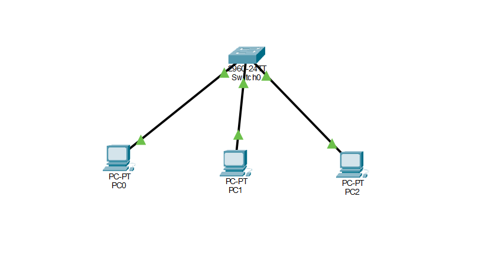

# Lab 01 — Basic Network Connectivity (Packet Tracer)

## Objective
Build a simple LAN using a switch and multiple PCs and verify connectivity using static IP addressing and ping tests.

---

## Topology
- 1 Cisco 2960 Switch
- 3 PCs
- Copper straight-through cables

---

## IP Addressing Scheme

| Device | IP Address     | Subnet Mask     |
|--------|----------------|------------------|
| PC0    | 192.168.1.10  | 255.255.255.0   |
| PC1    | 192.168.1.11  | 255.255.255.0   |
| PC2    | 192.168.1.12  | 255.255.255.0   |

---

## Connectivity Tests

Ping results from PC0:

ping 192.168.1.11
ping 192.168.1.12

Result: Successful

---

## Switch Verification

Command used: show mac address-table

Result:
Switch successfully learned MAC addresses on Fa0/1, Fa0/2, Fa0/3.

---

## Key Concepts Learned

- Layer 1: Physical connectivity
- Layer 2: MAC address learning
- Layer 3: IP addressing and communication
- ARP process
- Basic network troubleshooting

---

## Troubleshooting Performed

Tested incorrect IP configuration and verified connectivity failure.

---

## File Included

lab-01-basic-network-connectivity.pkt