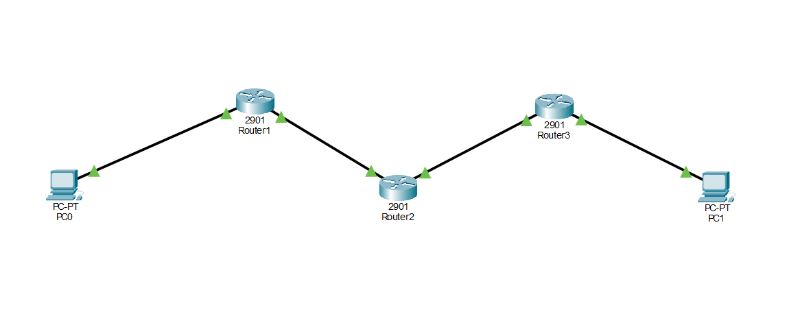

# Lab 02 — Static Routing
## Objective
This lab demonstrates static routing and how data moves between routers to connect two endpoints from different networks. Static routing is manually configured by a network administrator, giving full control over the path packets take — useful in small or predictable network environments where dynamic routing protocols aren't needed.
## Topology

| Device | Interface | IP Address | Subnet Mask |
|--------|-----------|------------|-------------|
| PC0 | NIC | 192.168.1.10 | 255.255.255.0 |
| R1 | Gi0/0 | 192.168.1.1 | 255.255.255.0 |
| R1 | Gi0/1 | 10.0.12.1 | 255.255.255.0 |
| R2 | Gi0/0 | 10.0.12.2 | 255.255.255.0 |
| R2 | Gi0/1 | 10.0.23.1 | 255.255.255.0 |
| R3 | Gi0/0 | 10.0.23.2 | 255.255.255.0 |
| R3 | Gi0/1 | 192.168.3.1 | 255.255.255.0 |
| PC1 | NIC | 192.168.3.10 | 255.255.255.0 |

## Configuration
Both PCs were assigned static IP addresses, subnet masks, and default gateways. The default gateway acts as the door for packets to exit when destined for a remote network — without it, PC0 would have no idea where to forward packets outside its own network.
Each router interface was assigned an IP address and brought up with `no shutdown`. Static routes were then configured on each router so they know where to forward packets for networks they aren't directly connected to:

```
R1: ip route 192.168.3.0 255.255.255.0 10.0.12.2
# Forward packets destined for PC1's network to R2

R2: ip route 192.168.3.0 255.255.255.0 10.0.23.2
# Forward packets destined for PC1's network onward to R3

R2: ip route 192.168.1.0 255.255.255.0 10.0.12.1
# Forward return packets destined for PC0's network back to R1

R3: ip route 192.168.1.0 255.255.255.0 10.0.23.1
# Forward return packets destined for PC0's network to R2
```

R2 required two static routes because it sits in the middle — it needs to know the path in both directions.
Verification
Tested connectivity hop by hop from PC0:

## Verification
Full device configurations are available in the `configs/` folder:
- `configs/R1.txt` - R1 running config
- `configs/R2.txt` - R2 running config
- `configs/R3.txt` - R3 running config

Ping test from PC0 to PC1 (192.168.3.10):
- Ping 192.168.1.1 (R1) — success
- Ping 10.0.12.2 (R2) — success after adding static routes
- Ping 10.0.23.2 (R3) — success
- Ping 192.168.3.10 (PC1) — success

## What I learned
I learned how to configure static routes and understand why each router needs explicit instructions for networks it isn't directly connected to. Initially the ping from PC0 to R2 was failing even though all IP addresses were configured — I knew something was missing. The missing piece was the `ip route` configuration telling each router where to forward packets for remote networks. I also learned that pings are two-way, which is why R2 needed a return route back toward PC0.
