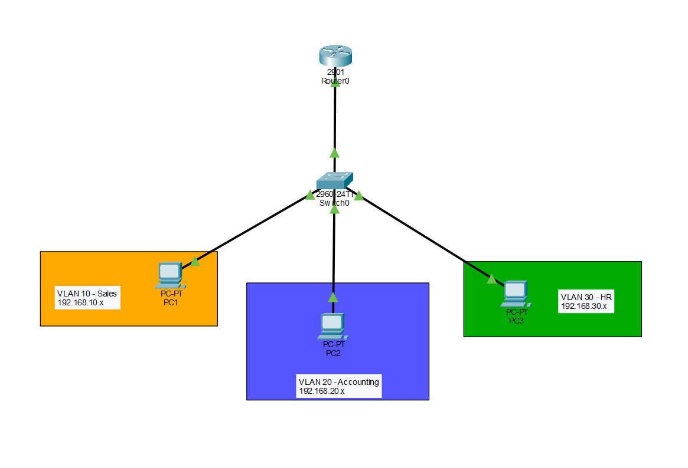

# Lab 03 — VLAN + Inter-VLAN Routing (Router-on-a-Stick)

## Objective
Built a multi-VLAN network on a single switch with three departments — Sales, Accounting, and HR — each isolated in their own VLAN. Configured a router-on-a-stick using subinterfaces to allow inter-VLAN routing across all three segments. The goal was to understand how Layer 2 isolation works and what it actually takes to route between VLANs.

## Topology

| Device | Interface | IP Address | Subnet Mask | Default Gateway |
|--------|-----------|------------|-------------|-----------------|
| PC1 | NIC | 192.168.10.10 | 255.255.255.0 | 192.168.10.1 |
| PC2 | NIC | 192.168.20.10 | 255.255.255.0 | 192.168.20.1 |
| PC3 | NIC | 192.168.30.10 | 255.255.255.0 | 192.168.30.1 |
| R1 | G0/0.10 | 192.168.10.1 | 255.255.255.0 | — |
| R1 | G0/0.20 | 192.168.20.1 | 255.255.255.0 | — |
| R1 | G0/0.30 | 192.168.30.1 | 255.255.255.0 | — |

## VLAN Table
| VLAN ID | Name | Assigned Port |
|---------|------|---------------|
| 10 | Sales | Fa0/1 |
| 20 | Accounting | Fa0/2 |
| 30 | HR | Fa0/3 |

## Concepts Covered
- VLAN creation and port assignment on a Cisco switch
- Access ports vs trunk ports and when to use each
802.1Q tagging — how the switch tags frames crossing the trunk
- Router-on-a-stick — using subinterfaces to route between VLANs on a single physical link
- How inter-VLAN traffic hairpins through the router even when source and destination are on the same physical switch

## Configuration

Full device configurations are available in the files below:
- [`sw1-config.txt`](sw1-config.txt)
- [`router-config.txt`](router-config.txt)

## Verification

| Command | What it confirmed |
|--------|-------------------|
| `show vlan brief` | VLANs 10, 20, and 30 active with correct ports assigned |
| `show interfaces trunk` | Fa0/24 trunking with 802.1Q encapsulation, all three VLANs forwarding |
| `show ip route` | All three subnets showing as directly connected on the router |

**Ping Results**
| Source | Destination | Result |
|--------|-------------|--------|
| PC1 | PC2 | Success |
| PC1 | PC3 | Success |
| PC2 | PC3 | Success |

## Key Takeaways
The commands were the hardest part going in — specifically configuring access and trunk modes on the switch and setting up subinterfaces on the router. I hadn't touched those before so it took a bit to get the syntax right.

What really made it click was going through simulation mode and watching the packet move hop by hop. I could see the switch tagging the frame with a dot1Q header as it crossed the trunk, the router receiving it, routing it to the right subinterface, and sending it back tagged for the destination VLAN. As a visual learner, stepping through the PDU inbound and outbound details at each hop made the whole router-on-a-stick model make sense in a way that just reading about it wouldn't have.

One thing worth noting — even though PC1, PC2, and PC3 are on the same physical switch, the traffic still has to travel all the way to the router and back. The switch can't route between VLANs on its own. That hairpin path is actually a known limitation of this design, and why larger networks use Layer 3 switches instead.

