# Lab 04 – DHCP Relay (ip helper-address)

## Objective

Configure a centralized DHCP server on VLAN 10 to dynamically assign IP addresses to hosts across three separate VLANs (20, 30, and 40) using the `ip helper-address` command on a router-on-a-stick setup.

---

## Topology

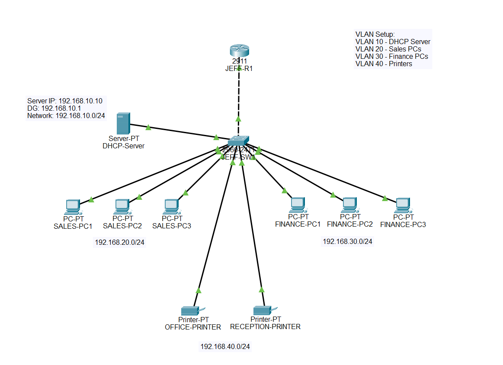

**Devices:**

| Device             | Type        | VLAN | Interface on SW1 |
|--------------------|-------------|------|------------------|
| DHCP-Server        | Server-PT   | 10   | Fa0/10           |
| SALES-PC1          | PC-PT       | 20   | Fa0/1            |
| SALES-PC2          | PC-PT       | 20   | Fa0/2            |
| SALES-PC3          | PC-PT       | 20   | Fa0/3            |
| FINANCE-PC1        | PC-PT       | 30   | Fa0/4            |
| FINANCE-PC2        | PC-PT       | 30   | Fa0/5            |
| FINANCE-PC3        | PC-PT       | 30   | Fa0/6            |
| OFFICE-PRINTER     | Printer-PT  | 40   | Fa0/7            |
| RECEPTION-PRINTER  | Printer-PT  | 40   | Fa0/8            |

---

## VLAN Plan

| VLAN | Name        | Network           | Default Gateway  |
|------|-------------|-------------------|------------------|
| 10   | DHCP Server | 192.168.10.0/24   | 192.168.10.1     |
| 20   | Sales       | 192.168.20.0/24   | 192.168.20.1     |
| 30   | Finance     | 192.168.30.0/24   | 192.168.30.1     |
| 40   | Printers    | 192.168.40.0/24   | 192.168.40.1     |

---

## IP Addressing

| Device        | IP Address      | Subnet Mask     | Default Gateway |
|---------------|-----------------|-----------------|-----------------|
| DHCP-Server   | 192.168.10.10   | 255.255.255.0   | 192.168.10.1    |
| SALES PCs     | DHCP (192.168.20.10+) | 255.255.255.0 | 192.168.20.1 |
| FINANCE PCs   | DHCP (192.168.30.10+) | 255.255.255.0 | 192.168.30.1 |
| Printers      | DHCP (192.168.40.10+) | 255.255.255.0 | 192.168.40.1 |

---

## DHCP Pool Configuration (on Server-PT)

| Pool Name | Default Gateway  | DNS Server | Start IP        | Subnet Mask     | Max Users |
|-----------|------------------|------------|-----------------|-----------------|-----------|
| VLAN20    | 192.168.20.1     | 8.8.8.8    | 192.168.20.10   | 255.255.255.0   | 100       |
| VLAN30    | 192.168.30.1     | 8.8.8.8    | 192.168.30.10   | 255.255.255.0   | 100       |
| VLAN40    | 192.168.40.1     | 8.8.8.8    | 192.168.40.10   | 255.255.255.0   | 100       |

> **Note:** The DHCP server itself (192.168.10.10) is statically configured. No pool is needed for VLAN 10.

---

## Configuration Files

Full device configurations are saved as `.txt` files in this repository:

- `JEFF-SW1-config.txt` — VLAN assignments, access ports, trunk port
- `JEFF-R1-config.txt` — Subinterfaces, encapsulation, `ip helper-address` entries

**Commands used to capture configs:**

| Device   | Command                    | Purpose                              |
|----------|----------------------------|--------------------------------------|
| JEFF-SW1 | `show running-config`      | Full switch configuration            |
| JEFF-SW1 | `show vlan brief`          | VLAN assignments per port            |
| JEFF-SW1 | `show interfaces trunk`    | Trunk port and allowed VLANs         |
| JEFF-R1  | `show running-config`      | Subinterfaces and helper addresses   |

---

## How DHCP Relay Works in This Lab

1. A host (e.g., SALES-PC1) powers on and broadcasts a **DHCP Discover** on VLAN 20.
2. The broadcast reaches JEFF-R1 via the trunk link on the VLAN 20 subinterface (`Gi0/0.20`).
3. Because `ip helper-address 192.168.10.10` is configured, the router **unicasts** the DHCP Discover to the server at 192.168.10.10 — this is the relay.
4. The DHCP server checks its pools, matches the request to the **VLAN20** pool based on the relay agent's source IP (192.168.20.1), and responds with an **IP Offer**.
5. The router forwards the offer back to the originating host.
6. The host completes the DORA process and receives its IP address.

> Without `ip helper-address`, DHCP Discover broadcasts are dropped at the router boundary and never reach the server on a different VLAN.

---

## Troubleshooting Notes

| Issue | Cause | Fix |
|-------|-------|-----|
| DHCP request failed after setting subinterface IPs | Subinterfaces were initially configured with the server IP instead of the VLAN gateway IP | Set each subinterface IP to the respective VLAN default gateway (e.g., 192.168.20.1 for VLAN 20) |
| DHCP still failing after fixing subinterfaces | The DHCP Server's own IP address was not configured | Statically assign 192.168.10.10/24 with gateway 192.168.10.1 on the server |

---

## Verification

```bash
! On any PC – confirm DHCP lease received
ipconfig

! On router – view active DHCP relay behavior (Packet Tracer simulation mode)
! Use simulation mode to trace DHCP Discover → relay → server → offer

! Cross-VLAN ping test
ping 192.168.30.11   ! from a VLAN 20 PC to a VLAN 30 PC
```

**Expected results:**
- Each PC/printer receives an IP in its respective VLAN subnet
- Cross-VLAN pings succeed (confirming inter-VLAN routing is working)
- DHCP server at 192.168.10.10 is reachable from all VLANs

---

## Screenshots

### DHCP Pool (Server-PT Services Tab)
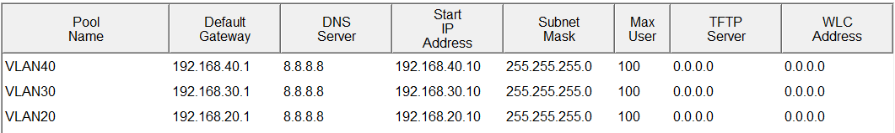

### DHCP Requests – All Devices
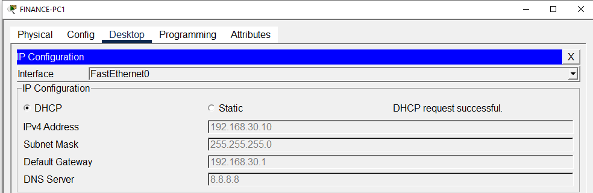

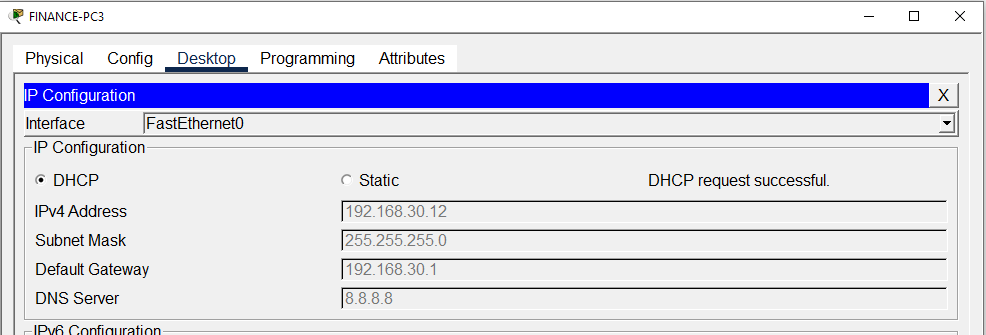
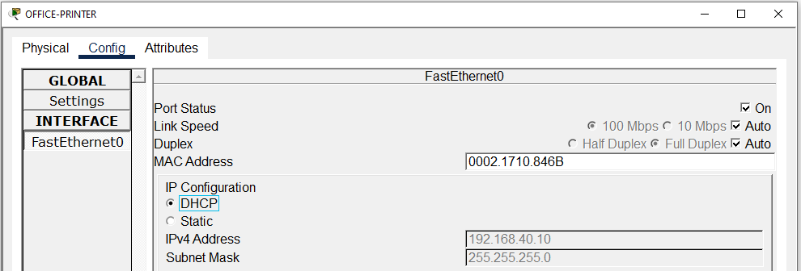
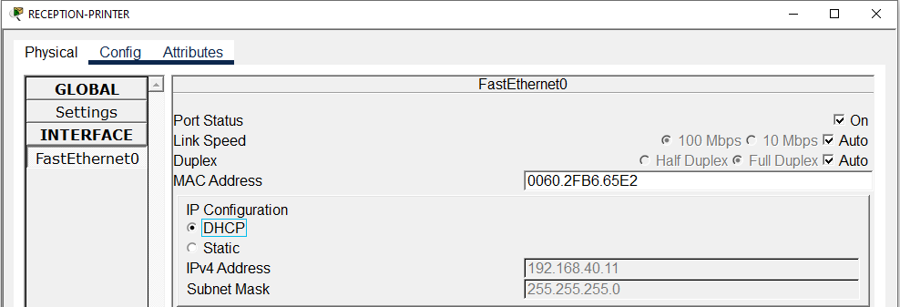
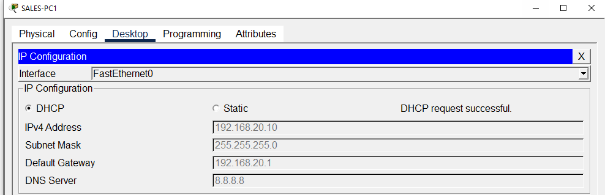
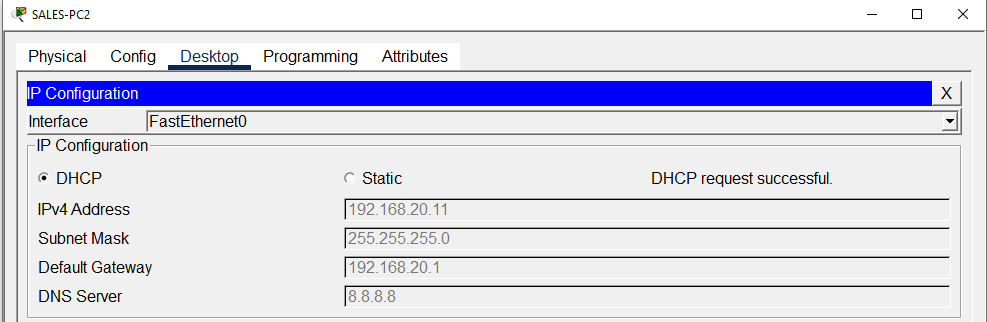


### ipconfig Verification
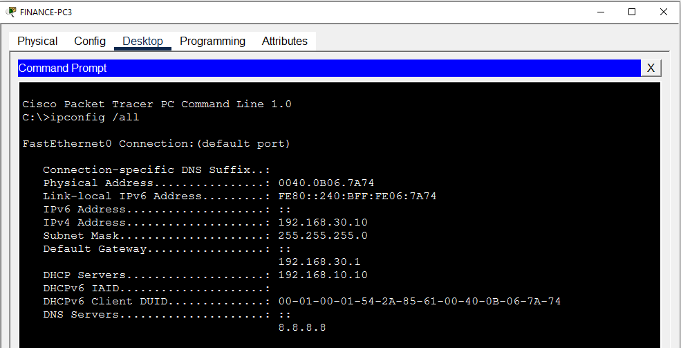
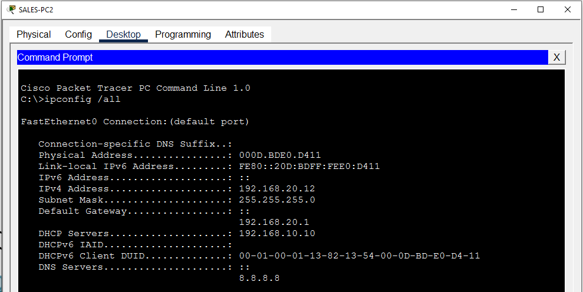

### Cross-VLAN Ping
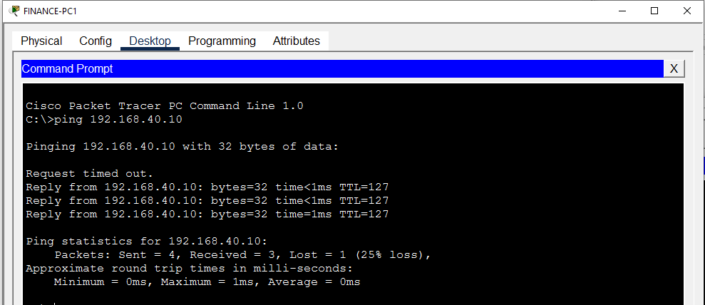
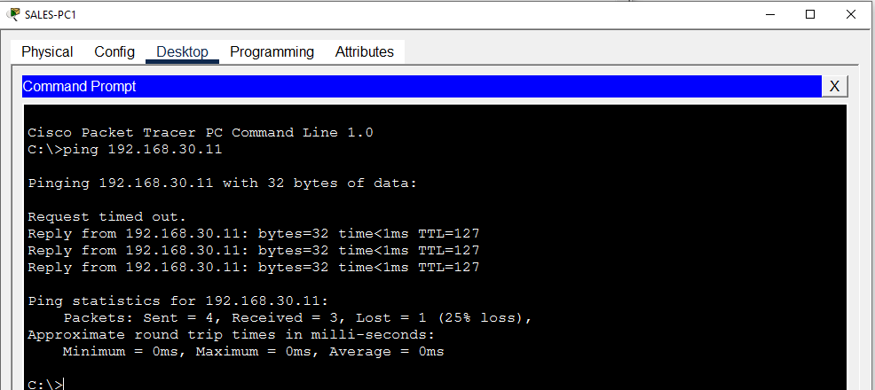


## Key Concepts Practiced

- Router-on-a-stick with subinterfaces and 802.1Q encapsulation
- VLAN segmentation and trunk configuration
- Centralized DHCP with `ip helper-address` (DHCP relay)
- DHCP pool configuration on Cisco Packet Tracer Server-PT
- Inter-VLAN routing verification via ping
