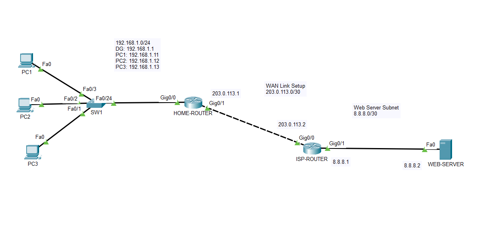

# Lab 05 – NAT Overload (PAT)

## Objective

Configure Port Address Translation (PAT/NAT Overload) on a SOHO network, allowing multiple private LAN clients to share a single public IP address when accessing the internet. The HOME-ROUTER also serves as a DHCP server for the LAN.

---

## Topology



| Device | Interface | IP Address | Notes |
|---|---|---|---|
| HOME-ROUTER | Gi0/0 | 192.168.1.1/24 | LAN gateway – NAT inside |
| HOME-ROUTER | Gi0/1 | 203.0.113.1/30 | WAN uplink – NAT outside |
| ISP-ROUTER | Gi0/0 | 203.0.113.2/30 | WAN peer |
| ISP-ROUTER | Gi0/1 | 8.8.8.1/30 | Link to web server |
| WEB-SERVER | Fa0 | 8.8.8.2/30 | Simulated internet host |
| PC1 | Fa0 | DHCP (192.168.1.11) | LAN client |
| PC2 | Fa0 | DHCP (192.168.1.12) | LAN client |
| PC3 | Fa0 | DHCP (192.168.1.13) | LAN client |

---

## Concepts

### Why PAT?

IPv4 address exhaustion means ISPs typically assign a single public IP per customer. PAT (also called NAT Overload) allows many private hosts to share that one public IP by tracking each session using unique **source port numbers**. This is what every home router does.

### NAT Translation Table

When a LAN client initiates a connection to the internet, the router intercepts the packet and records the mapping:

```
Inside Local          Inside Global         Outside Global
192.168.1.11:1025  →  203.0.113.1:1024  →  8.8.8.2:80
192.168.1.12:1025  →  203.0.113.1:1025  →  8.8.8.2:80
192.168.1.13:1025  →  203.0.113.1:1026  →  8.8.8.2:80
```

All three clients appear to the outside world as the same IP (203.0.113.1), differentiated only by port number. Return traffic is matched against the table and forwarded to the correct private host.

### Key Terms

| Term | Definition |
|---|---|
| Inside Local | Private IP of the LAN host before translation |
| Inside Global | Public IP seen by the outside world (after translation) |
| Outside Global | IP of the remote destination server |
| Overload | IOS keyword that enables port multiplexing (PAT) |

---

## Configuration

### HOME-ROUTER

```
! ============================================================
! DHCP Server
! ============================================================
ip dhcp excluded-address 192.168.1.1 192.168.1.10
ip dhcp pool LAN-POOL
 network 192.168.1.0 255.255.255.0
 default-router 192.168.1.1
 dns-server 8.8.8.2

! ============================================================
! NAT – Mark interfaces
! ============================================================
interface GigabitEthernet0/0
 ip address 192.168.1.1 255.255.255.0
 ip nat inside

interface GigabitEthernet0/1
 ip address 203.0.113.1 255.255.255.252
 ip nat outside

! ============================================================
! NAT – ACL and PAT rule
! ============================================================
access-list 1 permit 192.168.1.0 0.0.0.255

ip nat inside source list 1 interface GigabitEthernet0/1 overload

! ============================================================
! Default route to ISP
! ============================================================
ip route 0.0.0.0 0.0.0.0 203.0.113.2
```

### ISP-ROUTER

```
interface GigabitEthernet0/0
 ip address 203.0.113.2 255.255.255.252

interface GigabitEthernet0/1
 ip address 8.8.8.1 255.255.255.252
```

> No static routes needed on ISP-ROUTER. Both networks are directly connected, and all LAN traffic arrives already translated to HOME-ROUTER's public IP (203.0.113.1), which ISP-ROUTER can reach via its directly connected WAN interface.

### WEB-SERVER

```
IP Address:     8.8.8.2
Subnet Mask:    255.255.255.252
Default Gateway: 8.8.8.1
```

---

## Verification

See `configs/verification.txt` for full command output. Key results:

**`show ip dhcp binding`** – confirmed all three LAN clients received addresses via DHCP.

**`show ip nat translations`** – confirmed all three clients were translated to the same public IP (203.0.113.1) with unique port numbers while browsing http://8.8.8.2 simultaneously.

**`show ip nat statistics`** – confirmed correct inside/outside interface assignment and active translation hits.

**Web browser test** – PC1 and PC2 successfully loaded http://8.8.8.2 at the same time, demonstrating concurrent PAT sessions from different private hosts through a single public IP.


---

## Troubleshooting Notes

**NAT translation table appears empty after ping** – ICMP translations expire in ~60 seconds. Use HTTP (web browser) instead of ping to hold translations open long enough to verify with `show ip nat translations`.

**Web server not responding (red X in simulation mode)** – The server was receiving packets but dropping replies because its default gateway was not configured. Without a gateway, the server had no route to return traffic to 203.0.113.1 (a different subnet). Configuring the default gateway resolved this.

---

## Files

```
Lab-05-nat-overload/
├── lab-05-nat-overload.pkt
├── topology.png
├── configs/
│   ├── home-router-config.txt
│   ├── isp-router-config.txt
│   └── verification.txt
└── screenshots/
    └── http-web-browsing.png
```
