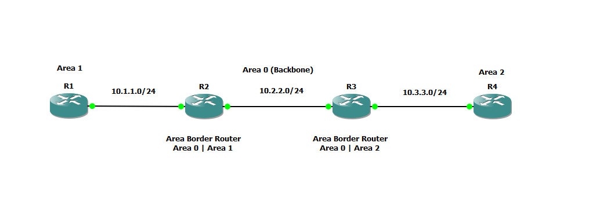

# Lab 06 – Multi-Area OSPF

## Objective
Design and implement a multi-area OSPF network spanning three areas, configure Area Border Routers (ABRs), and apply route summarization to reduce routing table size across area boundaries.

## Topology



## IP Addressing Table

| Device | Interface | IP Address | Area |
|--------|-----------|------------|------|
| R1 | f0/0 | 10.1.1.1/24 | Area 1 |
| R2 | f0/0 | 10.1.1.2/24 | Area 1 |
| R2 | f2/0 | 10.2.2.1/24 | Area 0 |
| R3 | f0/0 | 10.2.2.2/24 | Area 0 |
| R3 | f2/0 | 10.3.3.1/24 | Area 2 |
| R4 | f0/0 | 10.3.3.2/24 | Area 2 |

## Area Design

| Router | Role | Areas |
|--------|------|-------|
| R1 | Internal Router | Area 1 |
| R2 | Area Border Router | Area 0, Area 1 |
| R3 | Area Border Router | Area 0, Area 2 |
| R4 | Internal Router | Area 2 |

## Configuration Files

- [R1 Running Config](configs/r1-running-config.txt)
- [R2 Running Config](configs/r2-running-config.txt)
- [R3 Running Config](configs/r3-running-config.txt)
- [R4 Running Config](configs/r4-running-config.txt)

## Key Concepts Demonstrated

**Multi-Area OSPF Design** — Separating the network into distinct areas reduces LSA flooding and keeps routing tables manageable. All areas connect through Area 0 (backbone).

**Area Border Routers** — R2 and R3 sit at area boundaries, maintaining separate link-state databases for each connected area and generating Type 3 Summary LSAs to advertise routes between areas.

**Route Summarization** — Configured on both ABRs using the `area range` command, advertising summarized prefixes into the backbone rather than individual host routes. This keeps routing tables clean and scales to large networks.

**Inter-Area Routing** — Routes tagged as `O IA` in the routing table confirm traffic is crossing area boundaries correctly through the ABRs.

## Verification Commands

```
show ip ospf neighbor
show ip route ospf
show ip ospf database summary
ping <destination>
```

## Tools Used
- GNS3 2.2.58.1
- Cisco IOS 15.2(4)S5 (c7200-advipservicesk9)
- VMware Workstation
